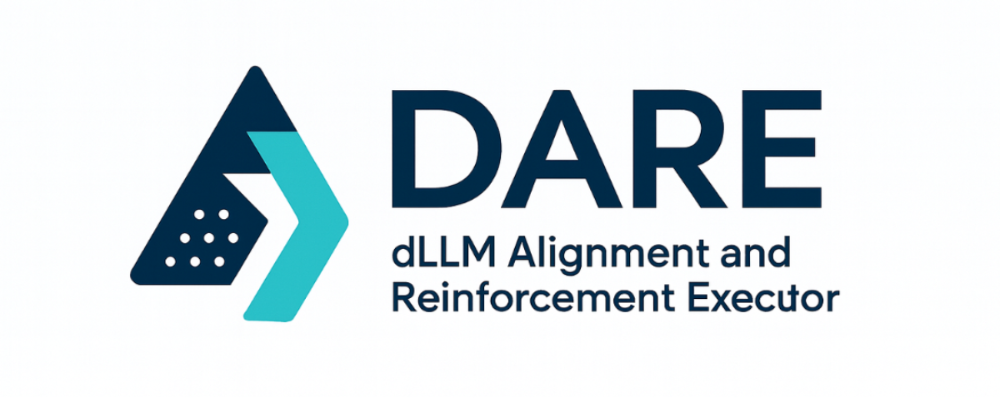

<p align="center">
  
</p>

<div align="center">

<h2>DARE: dLLM Alignment and Reinforcement Executor</h2>


</div>


## 🎯 Overview

We introduce DARE (dLLM Alignment and Reinforcement Executor), a flexible and efficient supervised-finetuning (SFT) and reinforcement learning (RL) training framework designed specifically for diffusion large language models (dLLMs). DARE also integrates a comprehensive evaluation platform.

DARE aims to be both flexible and user-friendly to use with:
- Easy extension of diverse RL algorithms for dLLMs
- Easy extension of comprehensive benchmark evaluations for dLLMs
- Seamless integration of existing and upcoming dLLM infras with modular APIs, ensuring compatibility and ease of use
- Ready integration with popular HuggingFace dLLMs


## 📢 News
- [2025-12-01]: We open-sourced our codebase of DARE, including training and evaluation with faster inference for dLLM. **DARE is still work in progress, we warmly welcome the research community in this direction for their collaborations, feedback and suggestions. Let's make diffusion large language model great!!!👊**


## 🔍 Catalogue

- [🎯 Overview](#-overview)
- [🏆 Key Features](#-key-features)
- [🛠️ Installation and Setup](#️-installation-and-setup)
- [🏋️ Training](#️-training)
- [📊 Evaluation](#-evaluation)
- [📈 Performance](#-performance)
- [📦 Supported Models](#-supported-models)
- [🌱 Supported RL Algorithms](#-supported-rl-algorithms)
- [📧 Contact](#-contact)
- [📚 Citation](#-citation)
- [🙏 Acknowledgments](#-acknowledgments)


## 🏆 Key Features

- **Acceleration Inference/Rollout for dLLMs**
  - Block cache ([Fast-dLLM](https://github.com/NVlabs/Fast-dLLM)) for LLaDAs and Dreams faster rollout
  - Inference engine ([lmdeploy](https://github.com/InternLM/lmdeploy)) for SDARs 2-4× faster rollout
- **Parallelism for dLLMs**
  - Support flash_attn
  - Support flash_attn_varlen
  - Support flash_attn_with_kvcache
  - Support sequence_parallel
- **Comprehensive Evaluation for dLLMs**
  - Integrate [OpenCompass](https://github.com/open-compass/opencompass) framework with faster inference
- **Model Diversity**
  - dLLM that trained from scratch (e.g., LLaDA)
  - dLLM that continuous trained from AR, i.e., AR-to-Diffusion (e.g., Dream, SDAR)
- **Upcoming Features**
  - MoE, LLaDA2.0, Multi-Modal, etc.


## 🛠️ Installation and Setup

Our training framework is built on top of [verl](https://github.com/volcengine/verl), providing a robust foundation for supervised finetuning and reinforcement learning experiments, and our evaluation framework is built on the top of [opencompass](https://github.com/open-compass/opencompass), providing a comprehensive and fast evaluations.

⚠️ *Note*: Due to some **irreconcilable dependency conflicts** between packages, we **strongly recommend using two separate virtual environments**, for training and evaluation, respectively.

### 🚀 Quick Installation

Clone the DARE Repo:
```bash
git clone https://github.com/yjyddq/DARE
```

Build training vitual environment:

```bash
# Create and activate environment
conda create -n DARE python=3.10 -y
conda activate DARE

# Install dependencies
cd DARE
pip install -r requirements.txt
pip install flash-attn==2.7.4.post1 --no-build-isolation
# or 
# install from whl
# pip install flash_attn-2.7.4.post1+cu12torch2.6cxx11abiFALSE-cp310-cp310-linux_x86_64.whl
```

Build evaluation vitual environment:

```bash
# Create and activate environment
conda create --name opencompass python=3.10 -y
conda activate opencompass

# Install dependencies
cd DARE/opencompass
pip install -e .

# For HumanEval evaluation, install the additional dependency:
git clone https://github.com/open-compass/human-eval.git
cd human-eval && pip install -e .
cd ..

# For Math evaluation, pip install the additional dependency:
pip install math_verify latex2sympy2_extended

## Full installation (with support for more datasets)
# pip install "opencompass[full]"

## Environment with model acceleration frameworks
# pip install "opencompass[lmdeploy]"
# or
# pip install lmdeploy==0.10.1
```

### 🔧 Model Setup

After downloading [LLaDA-8B-Instruct](https://huggingface.co/GSAI-ML/LLaDA-8B-Instruct), replace the source files with our modified versions to enable several key features:

```bash
# Copy modified files to your LLaDA model directory
cp models/xxx/* <path_to_llada_model>/
```

Or you can move the model weights (`.safetensors`) to `model/xxx/*`

```bash
# Copy weights to models/xxx/ directory
cp <path_to_llada_model>/*.safetensors models/xxx/
```

👀 Stay tuned for the adaptation of several key features to other models (i.e., Dream, SDAR, etc.)

### 🗄️ Dataset Setup

Preprocessed datasets is under `data/preprocessed`. Please refer `verl.utils.preprocess` to organize datasets. 


## 🏋️ Training

### 🚀 Quick Start

```bash
bash scripts/run_sft.sh # | scripts/run_sft_peft.sh
```

Alternatively, use/write scripts in recipe/xxx/run_xxx.sh

```bash
# peft for llada_8b_instruct
bash recipe/run_sft_peft_llada_8b_instruct.sh 

# sft for dream_7b_instruct
bash recipe/run_sft_dream_7b_instruct.sh 

# peft for sdar_8b_chat
bash recipe/run_sft_peft_sdar_8b_chat.sh 
```


## 📊 Evaluation

### 🚀 Quick Start

First, please follow [opencompass](https://github.com/open-compass/opencompass) for benchmark dataset preparation. Then, you need to specify the model path in `opencompass/opencompass/configs/models/dllm/*`. For example `llada_instruct_8b.py`:

```bash
from opencompass.models import LLaDAModel

models = [
    dict(
        type=LLaDAModel,
        abbr='llada-8b-instruct',
        path='/TO/YOUR/PATH', # Need to modify
        max_out_len=1024,
        batch_size=1,
        run_cfg=dict(num_gpus=1),
    )
]
```

Evaluation of LLaDA-8B-Instruct on mmlu with hf backend:

```bash
bash scripts/eval_llada.sh --task mmlu
```

Evaluation of SDAR-8B-Chat on mmlu with lmdeploy backend:

```bash
bash scripts/eval_sdar_8b_chat.sh --task mmlu --engine lmdeploy
```

If you want to add more benchmarks, models, or custom datasets, please refer to the [Evaluation Guideline](https://github.com/yjyddq/DARE/blob/main/opencompass/README.md).


## 📦 Supported Models

DARE is still work in progress. We are considering supporting more models for training and evaluation as soon as possible.

| Model | Parameters | Training Support | Inference Acceleration/Engine |
|-------|------------|------------------------|------------------------|
| **LLaDA-8B-Base** | 8B | sft/rl | hf [Fast-dLLM](https://github.com/NVlabs/Fast-dLLM) |
| **LLaDA-8B-Instruct** | 8B | sft/rl | hf [Fast-dLLM](https://github.com/NVlabs/Fast-dLLM) |
| **LLaDA-1.5** | 8B | sft/rl | hf [Fast-dLLM](https://github.com/NVlabs/Fast-dLLM) |
| **Dream** | 7B | sft | hf [Fast-dLLM](https://github.com/NVlabs/Fast-dLLM) |
| **SDAR-1.7B-Chat** | 1.7B | sft | [lmdeploy](https://github.com/InternLM/lmdeploy) |
| **SDAR-4B-Chat** | 4B | sft | [lmdeploy](https://github.com/InternLM/lmdeploy) |
| **SDAR-8B-Chat** | 8B | sft | [lmdeploy](https://github.com/InternLM/lmdeploy) |

**TODO...**


## 🌱 Supported RL Algorithms

| Algorithm | Arxiv | Source Code |
|-------|------------|------------------------|
| **d1** | [2504.12216](https://arxiv.org/pdf/2504.12216) | [dllm-reasoning/d1](https://github.com/dllm-reasoning/d1) |
| **coupled-grpo** | [2506.20639](https://arxiv.org/pdf/2506.20639) | [apple/ml-diffucoder](https://github.com/apple/ml-diffucoder) |
| **mdpo** | [2508.13148](https://arxiv.org/pdf/2508.13148) | [autonomousvision/mdpo](https://github.com/autonomousvision/mdpo) |
| **cj-grpo** | [2509.23924](https://arxiv.org/pdf/2509.23924) | [yjyddq/EOSER-ASS-RL](https://github.com/yjyddq/EOSER-ASS-RL) |
| **spg** | [2510.09541](https://arxiv.org/pdf/2510.09541) | [facebookresearch/SPG](https://github.com/facebookresearch/SPG) |
| **bgpo** | [2510.11683](https://arxiv.org/pdf/2510.11683) | [THU-KEG/BGPO](https://github.com/THU-KEG/BGPO) |

**TODO...**


## 📈 Performance

**Baseline**

| Bench\Model | LLaDA-8B-Instruct | LLaDA-8B-Instruct + Fast-dLLM | Dream-7B-Instruct | SDAR-8B-Chat | SDAR-8B-Chat + lmdeploy |
|-------|------------|------------------------|-------|------------|------------------------|
| **MMLU** | 65.24 | 65.17 | 66.83 |  |  | |
| **MMLU-Pro** | 36.82 | 34.58 | 31.89 |  |  |  |
| **Hellaswag** | 75.30 | 74.41 | 63.23 |  |  |  |
| **ARC-C** | 87.80 | 87.80 | 81.36 |  |  |  |
| **GSM8k** | 79.68 | 78.39 | 83.24 |  |  |  |
| **MATH** | 41.08 | 40.58 | 48.02 |  |  |  |
| **GPQA** | 30.81 | 31.82 | 26.77 |  |  |  |
| **AIME24** | 0.83 | 2.08 | 0.83 |  |  |  |
| **AIME25** | 0.42 | 0.00 | 0.00 |  |  |  |
| **Olympiad** | 8.95 | 9.70 | 12.22 |  |  |  |  |
| **HumanEval** | 46.34 | 43.29 |  |  |  |  |
| **MBPP** | 38.80 | 20.00 |  |  |  |  |

**TODO...**


## 📧 Contact

For any questions or collaboration inquiries, feel free to reach out Jingyi Yang at: [yangjingyi946@gmail.com](yangjingyi946@gmail.com)


## 📚 Citation

If you find our work useful, please consider citing:

```bibtex
@misc{DARE,
    author = {Jingyi Yang},
    title = {DARE: dLLM Alignment and Reinforcement Executor},
    year = {2025},
    publisher = {GitHub},
    journal = {GitHub repository},
    howpublished = {\url{https://github.com/yjyddq/DARE}},
}

@article{yang2025taming,
  title={Taming Masked Diffusion Language Models via Consistency Trajectory Reinforcement Learning with Fewer Decoding Step},
  author={Yang, Jingyi and Chen, Guanxu and Hu, Xuhao and Shao, Jing},
  journal={arXiv preprint arXiv:2509.23924},
  year={2025}
}
```


## 🙏 Acknowledgments

We thank the open-source community for their wonderful work and valuable contributions:
- Models Source: [GSAI-ML](https://huggingface.co/GSAI-ML), [Dream-org](https://huggingface.co/Dream-org), [JetLM](https://huggingface.co/JetLM), [huggingface](https://huggingface.co/) for model supply or hosting
- Algorithm: [d1](https://github.com/dllm-reasoning/d1), [CJ-GRPO](https://github.com/yjyddq/EOSER-ASS-RL), [MDPO](https://github.com/autonomousvision/mdpo), [Coupled-GRPO](https://github.com/apple/ml-diffucoder), [SPG](https://github.com/facebookresearch/SPG)
- Training Framework: [verl](https://github.com/volcengine/verl), [BGPO](https://github.com/THU-KEG/BGPO), [Dream](https://github.com/DreamLM/Dream)
- Inference Acceleration/Engine: [Fast-dLLM](https://github.com/NVlabs/Fast-dLLM), [lmdeploy](https://github.com/InternLM/lmdeploy)
- Evaluation Framework: [opencompass](https://github.com/open-compass/opencompass), [LLaDA](https://github.com/ML-GSAI/LLaDA)


